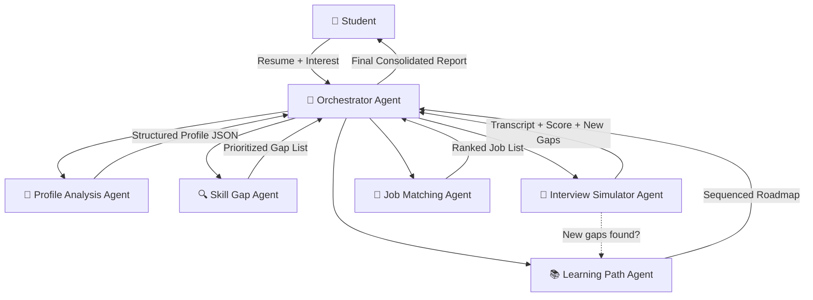

# CareerCompass AI — Full Project Analysis

> **Branch:** `maxi` · **Repo:** [CareerCompass_AI](https://github.com/sankajithdjinasena/CareerCompass_AI.git) · **Competition:** CodeSplash '26 — Agentic AI Phase

---

## 🎯 What Is This Project?

CareerCompass AI is a **multi-agent, autonomous career-coaching system** for computing undergraduates at Sabaragamuwa University of Sri Lanka. A student uploads their resume and states an area of interest (e.g. "data science"), and the system autonomously:

1. Parses the resume into structured data
2. Identifies skill gaps against a target role
3. Builds a personalized learning roadmap
4. Conducts an adaptive mock interview
5. Recommends matching jobs/internships

The key differentiator is the **closed feedback loop** — if the mock interview uncovers a gap the Skill Gap Agent missed, the system automatically revises the learning roadmap without any re-input from the user.

---

## 🏗️ Architecture Overview — 6 Agents



| Agent | What It Does | Tools It Uses |
|---|---|---|
| **Orchestrator** | Plans, delegates, merges results, triggers adaptive re-runs | Shared context store |
| **Profile Analysis** | Parses resume → structured JSON (skills, experience, education) | pdfplumber, spaCy NLP |
| **Skill Gap** | Benchmarks profile vs target-role skill taxonomy | Skills-taxonomy vector DB |
| **Learning Path** | Builds sequenced course/resource roadmap for top gaps | Course/resource retrieval API |
| **Interview Simulator** | Generates role-specific Q&A, scores readiness, detects new gaps | LLM Q&A engine |
| **Job Matching** | Ranks jobs/internships by fit with rationale | Job listings API/dataset |

---

## 🛠️ Tech Stack

| Layer | Technology |
|---|---|
| **LLM** | Gemini API or GPT-family (proposal says flexible) |
| **Agent Framework** | CrewAI or LangChain (LangGraph) |
| **Orchestration** | LangGraph state machine / CrewAI Process |
| **Backend** | Python + FastAPI |
| **Frontend** | React + Tailwind CSS |
| **Resume Parsing** | spaCy + pdfplumber |
| **Vector DB** | ChromaDB or FAISS |
| **Relational DB** | PostgreSQL or MySQL |
| **Deployment** | Render / Railway / AWS free tier |

---

## 📁 Target Project Structure

```
careercompass-ai/
├── backend/
│   ├── agents/
│   │   ├── orchestrator.py              # Central coordinator
│   │   ├── profile_analysis_agent.py    # Resume parser agent
│   │   ├── skill_gap_agent.py           # Gap analysis agent
│   │   ├── learning_path_agent.py       # Roadmap builder agent
│   │   ├── interview_simulator_agent.py # Mock interview agent
│   │   └── job_matching_agent.py        # Job recommender agent
│   ├── tools/
│   │   ├── resume_parser.py             # PDF/text → structured data
│   │   ├── skills_taxonomy_db.py        # Vector DB operations
│   │   └── job_course_retriever.py      # Fetch jobs/courses
│   ├── shared_store/
│   │   └── context_store.py             # Vector DB + session memory wrapper
│   ├── api/
│   │   └── main.py                      # FastAPI app + REST endpoints
│   ├── data/
│   │   ├── skills_taxonomy.json         # Curated role → skill mappings
│   │   ├── sample_jobs.json             # Sample job listings
│   │   └── sample_courses.json          # Sample course listings
│   ├── .env.example
│   └── requirements.txt
├── frontend/
│   ├── src/
│   └── package.json
└── README.md
```

---

## 📋 What We Need to Build (Full Breakdown)

### Stage 1 — Foundation
- [ ] **Resume Parser Tool** (`tools/resume_parser.py`) — Use pdfplumber + spaCy to extract text from PDF resumes and structure it into JSON (name, contact, skills, experience, education, projects)
- [ ] **Profile Analysis Agent** (`agents/profile_analysis_agent.py`) — CrewAI/LangChain agent that calls the resume parser tool and produces a validated structured profile
- [ ] **Basic FastAPI endpoint** (`api/main.py`) — `/upload-resume` endpoint that accepts a PDF and returns the structured profile

### Stage 2 — Core Agents
- [ ] **Skills Taxonomy Dataset** (`data/skills_taxonomy.json`) — Curated JSON mapping target roles (e.g. "Backend Developer", "Data Scientist") to required skills, proficiency levels, and categories
- [ ] **Skills Taxonomy DB Tool** (`tools/skills_taxonomy_db.py`) — Load taxonomy into ChromaDB/FAISS for vector similarity search
- [ ] **Skill Gap Agent** (`agents/skill_gap_agent.py`) — Compares structured profile against the taxonomy, outputs a prioritized list of missing/weak skills
- [ ] **Course/Resource Dataset** (`data/sample_courses.json`) — Curated list of courses (Coursera, Udemy, YouTube, etc.) mapped to skills
- [ ] **Job/Course Retriever Tool** (`tools/job_course_retriever.py`) — Retrieves matching courses/resources for a given skill gap
- [ ] **Learning Path Agent** (`agents/learning_path_agent.py`) — Builds a sequenced roadmap addressing highest-priority gaps first

### Stage 3 — Interaction Layer
- [ ] **Interview Simulator Agent** (`agents/interview_simulator_agent.py`) — Generates role-specific interview questions, evaluates live user answers via LLM, produces a readiness score, and flags newly-detected skill gaps
- [ ] **Job Listings Dataset** (`data/sample_jobs.json`) — Curated/synthetic job and internship listings with role, skills required, company, location, etc.
- [ ] **Job Matching Agent** (`agents/job_matching_agent.py`) — Ranks job listings against the (possibly revised) candidate profile, includes rationale

### Stage 4 — Orchestration
- [ ] **Shared Context Store** (`shared_store/context_store.py`) — Vector DB + session memory wrapper that all agents read/write through
- [ ] **Orchestrator Agent** (`agents/orchestrator.py`) — LangGraph state machine or CrewAI Process that:
  - Decomposes user goal into task graph
  - Delegates to specialist agents in dependency order
  - Runs independent agents concurrently
  - Implements the **adaptive feedback loop** (Interview Simulator → Learning Path re-trigger)
  - Merges all outputs into a final consolidated report
  - Handles retries, failures, and graceful degradation

### Stage 5 — Polish & Testing
- [ ] **React Frontend** — Dashboard with: resume upload, interest selection, progress display, skill-gap visualization, roadmap display, interactive interview UI, job list display
- [ ] **API Endpoints** — Full REST API connecting frontend ↔ orchestrator
- [ ] **Input/Output Validation** — Schema validation for all agent outputs
- [ ] **Safety Guardrails** — Rate limiting, retry caps, input validation, data privacy
- [ ] **Testing** — Unit tests per agent, integration tests for full pipeline, benchmark evaluation (15–20 sample resumes)

---

## 🔑 Key Environment Variables Needed

| Variable | Required | Description |
|---|---|---|
| `GROQ_API_KEY` or `GEMINI_API_KEY` | Yes | LLM provider API key |
| `GROQ_MODEL` or `GEMINI_MODEL` | Yes | Model name for agent reasoning |
| `DATABASE_URL` | Yes | PostgreSQL/MySQL connection string |
| `VECTOR_DB_PATH` | Yes | ChromaDB/FAISS path |
| `MAX_AGENT_RETRIES` | No | Cap on Orchestrator retry loops (default: 3) |

---

## 📊 Success Metrics

| Metric | Target |
|---|---|
| Task completion rate | ≥ 90% end-to-end without human intervention |
| Skill-gap accuracy | ≥ 85% agreement with manual benchmark |
| Processing time | < 2 minutes resume → full roadmap |
| Human intervention rate | < 10% of runs |
| Tool-call success rate | ≥ 95% |
| Feedback loop accuracy | Always re-triggers Learning Path on new gaps |

---

## ⚠️ Key Risks & Mitigations

| Risk | Mitigation |
|---|---|
| LLM hallucination | Ground outputs in curated taxonomy; validate against schemas |
| Inconsistent resume formats | Resilient parsing pipeline + LLM fallback |
| No real-time job APIs | Curated sample dataset for prototype |
| Agent coordination failures | Capped retries + graceful degradation |

---

## 🗂️ Current Repo State

The repo currently only has:
- `README.md` — Project overview and setup instructions
- `proposal.md` — ✅ Just created: markdown version of the proposal

**Everything else needs to be built from scratch.** The entire `backend/`, `frontend/`, agents, tools, data, and API directories are yet to be created.
